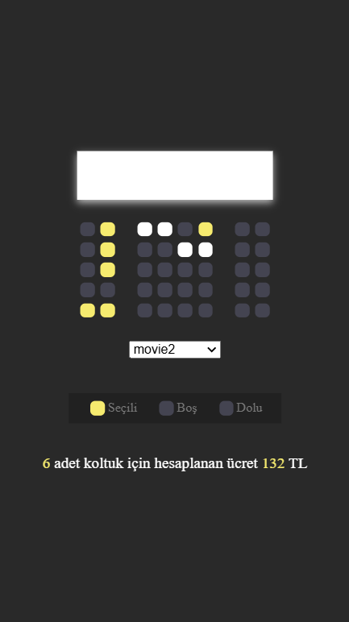

# Sinema Bilet Rezervasyonu

Bu proje, basit bir sinema bilet rezervasyon uygulamasıdır. Kullanıcılar, mevcut koltukları seçip rezervasyon yapabilir ve seçilen koltuklar ile ilgili ücret hesaplamalarını görebilir. Ayrıca, yapılan seçimler tarayıcı yerel depolamasına kaydedilir ve sayfa yenilendiğinde geri yüklenir.

## Özellikler

- Koltuk seçimi ve rezervasyon işlemi
- Film seçimi ve fiyat güncellemesi
- Seçilen koltuk sayısı ve toplam ücret hesaplaması
- Seçimlerin yerel depolama ile saklanması ve geri yüklenmesi

## Kullanılan Teknolojiler

- **HTML**: Sayfanın temel yapısını oluşturmak için kullanıldı.
- **CSS**: Tasarım ve görsel düzenlemeler için kullanıldı.
- **JavaScript**: Dinamik işlevsellik ve kullanıcı etkileşimleri için kullanıldı.

## Öğrendiklerim

Bu projeyi yaparken şunları öğrendim:

1. **LocalStorage Kullanımı**
   - Kullanıcı seçimlerini tarayıcıda saklamayı ve sayfa yenilendiğinde geri yüklemeyi öğrendim.

2. **Event Listener Kullanımı**
   - `addEventListener` ile kullanıcı etkileşimlerini nasıl dinleyip işleyebileceğimi öğrendim.

3. **DOM Manipülasyonu**
   - JavaScript kullanarak HTML elementlerini nasıl değiştirebileceğimi ve bu elementlere nasıl dinamik sınıflar ekleyebileceğimi öğrendim.

4. **Map ve ForEach Kullanımı**
   - Diziler üzerinde nasıl dolaşabileceğimi ve bu işlemleri projede nasıl kullanabileceğimi anladım.

## Ekran Görüntüsü

- Her türlü geri bildiriminiz ve öneriniz için teşekkür ederim! -
